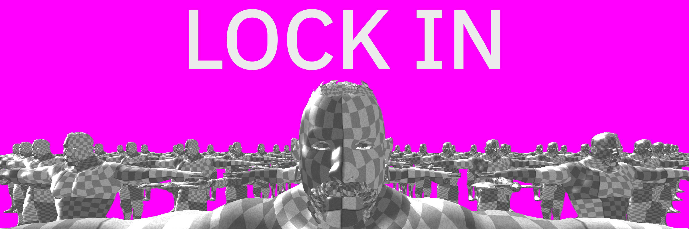

# Rusty Rift

## Plans

### Phase 1

- [x] Client window and renderer
- Renderer features
    - [x] Static mesh rendering
    - [ ] Shadow mapping
    - [ ] Skeletal animation (GPU? or nah?)

### Phase 2

- Game entities setup

### Phase 3

- Simple networking
    - [ ] Client server communication
    - [ ] Simple data layer

### Phase 4

- Nicer rendering feratures
    - [ ] Simple PBR?
    - [ ] Particles
    - [ ] Bloom
